## Reading the dataset


```r
stackloss_ <- read.csv("stackloss.csv", header=TRUE,sep=" ")
```

```
## Warning in file(file, "rt"): cannot open file 'stackloss.csv': No such file or
## directory
```

```
## Error in file(file, "rt"): cannot open the connection
```

## Problem 1:

### 1 a) Fitting OLS of Stack.Loss as a function of Acid.Conc


```r
OLS = lm(Stack.Loss~Acid.Conc,data=stackloss_)
summary(OLS)
```

```
## 
## Call:
## lm(formula = Stack.Loss ~ Acid.Conc, data = stackloss_)
## 
## Residuals:
##     Min      1Q  Median      3Q     Max 
## -1.1584 -0.5584 -0.3066  0.1247  2.2416 
## 
## Coefficients:
##             Estimate Std. Error t value Pr(>|t|)  
## (Intercept) -42.7441    23.4027  -1.826   0.0835 .
## Acid.Conc     0.7590     0.3992   1.901   0.0725 .
## ---
## Signif. codes:  0 '***' 0.001 '**' 0.01 '*' 0.05 '.' 0.1 ' ' 1
## 
## Residual standard error: 0.9565 on 19 degrees of freedom
## Multiple R-squared:  0.1599,	Adjusted R-squared:  0.1156 
## F-statistic: 3.615 on 1 and 19 DF,  p-value: 0.07252
```

### Observation:

Here, the slope of Acid.Conc is 0.7590 which implies that there is a
weak positive relationship between Acid.Conc and Stack.Loss. We can also
say that with 1 unit of Acid.Conc there is about .75 times increase
Stack.Loss But, we can also see that the p-value for Acid.Conc is higher
than the conventional threshold of 0.05 which suggests that the
Acid.Conc is not a. significant predictor of Stack.Loss

The intercept here is -42.7441 which implies that the predicted
Stack.Loss is -42.7441 when the Acid.Conc is 0. However, since Acid.Conc
cannot be 0 in the given chemical process, this value might not be
meaningful.

### 1 b) Centering Acid.Conc and refitting the model


```r
stackloss_['Acid.Conc.c'] = stackloss_$Acid.Conc - mean(stackloss_$Acid.Conc)

OLS1 = lm(Stack.Loss~Acid.Conc.c,data=stackloss_)

summary(OLS1)
```

```
## 
## Call:
## lm(formula = Stack.Loss ~ Acid.Conc.c, data = stackloss_)
## 
## Residuals:
##     Min      1Q  Median      3Q     Max 
## -1.1584 -0.5584 -0.3066  0.1247  2.2416 
## 
## Coefficients:
##             Estimate Std. Error t value Pr(>|t|)    
## (Intercept)   1.7524     0.2087   8.395 8.13e-08 ***
## Acid.Conc.c   0.7590     0.3992   1.901   0.0725 .  
## ---
## Signif. codes:  0 '***' 0.001 '**' 0.01 '*' 0.05 '.' 0.1 ' ' 1
## 
## Residual standard error: 0.9565 on 19 degrees of freedom
## Multiple R-squared:  0.1599,	Adjusted R-squared:  0.1156 
## F-statistic: 3.615 on 1 and 19 DF,  p-value: 0.07252
```

### Observation:

After centering the Acid.Conc predictor, we can see that the slope is
still at 0.7590, indicating that with every 1 unit increase in Acid.Conc
there is about 0.75 times increase in Stack.Loss. However, the intercept
of the model is now 1.7524 which is the value of the predicted
Stack.Loss when the Acid.Conc is at its mean value.

### 1 c) Model Assumption for OLS1


```r
plot(OLS1,which=1)
```

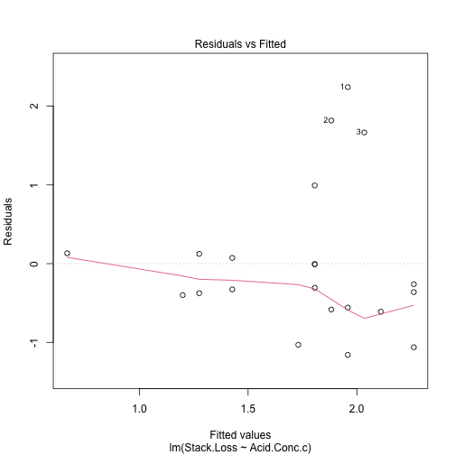


```r
residualPlots(OLS1)
```

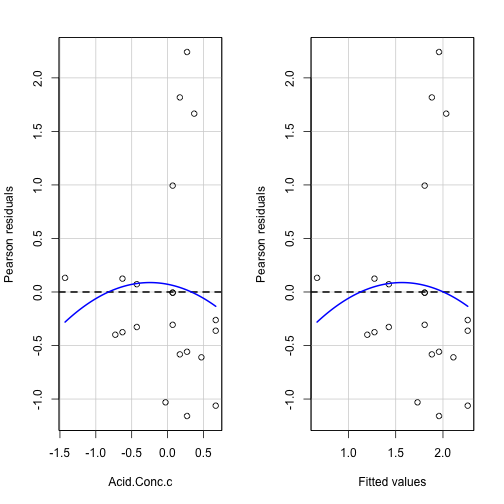

```
##             Test stat Pr(>|Test stat|)
## Acid.Conc.c   -0.4322           0.6707
## Tukey test    -0.4322           0.6656
```


```r
qqPlot(OLS1$residuals)
```

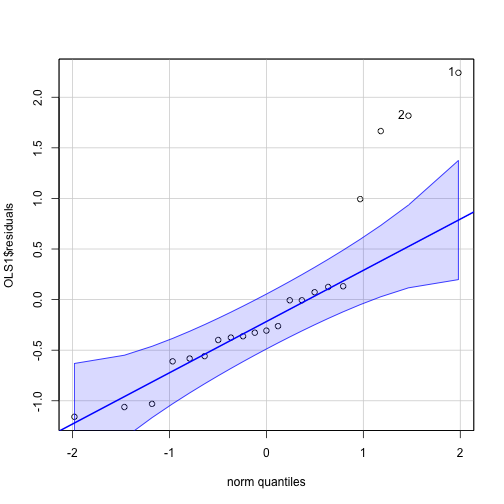

```
## [1] 1 2
```

### Observation:

In the above plots, I have observed the following: 1. Mean Zero: Here we
can see that the mean zero assumption is being violated and this can
lead to biased coefficient estimates and therefore we cannot trust the
conclusions derived from the model. 2. Homoscedasticity: As we can see
that the variance is not constant in the plot of residual vs predicted
values, the homoscedasticity assumption is being violated here. This can
also lead to biased coefficients which make the model highly inaccurate.
3. Normality: In thw qqplot, we can observe that the residuals are not
normally distributed and as all the statistical test within linear
regression are based on this assumption that the residuals are normal,
we cannot trust the outcomes of those tests like the p-values and the
confidence intervals.

### 1 d) Finding the point with highest leverage and assessing its influence over the slope parameter


```r
plot(hatvalues(OLS1), type='h', col="blue", ylab="Hat Values", main="Hat values")
```

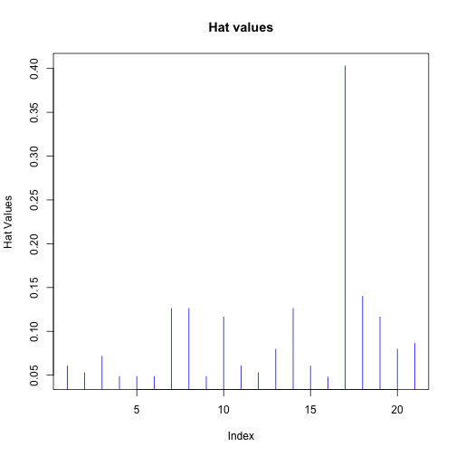

Here I have used hat values to find the leverage point and as we can see
in the plot above, observation 17th looks like the obvious point of
leverage.

Now lets assess its influence on slope. I am doing this by removing the
point of leverage(point with highest hat value) and fitting the model.


```r
lvrg_pt = which.max(hatvalues(OLS1))
OLS1_without_lvrg_pt = lm(Stack.Loss~Acid.Conc.c,data = stackloss_[-lvrg_pt,])
summary(OLS1_without_lvrg_pt)
```

```
## 
## Call:
## lm(formula = Stack.Loss ~ Acid.Conc.c, data = stackloss_[-lvrg_pt, 
##     ])
## 
## Residuals:
##     Min      1Q  Median      3Q     Max 
## -1.1628 -0.5674 -0.2965  0.1226  2.2372 
## 
## Coefficients:
##             Estimate Std. Error t value Pr(>|t|)    
## (Intercept)   1.7419     0.2227   7.823 3.36e-07 ***
## Acid.Conc.c   0.8139     0.5175   1.573    0.133    
## ---
## Signif. codes:  0 '***' 0.001 '**' 0.01 '*' 0.05 '.' 0.1 ' ' 1
## 
## Residual standard error: 0.9819 on 18 degrees of freedom
## Multiple R-squared:  0.1208,	Adjusted R-squared:  0.07196 
## F-statistic: 2.473 on 1 and 18 DF,  p-value: 0.1332
```


```r
plot(stackloss_$Acid.Conc.c, stackloss_$Stack.Loss,pch=16,xlab = "Centered Acid Concentration",ylab = "Stack Loss",main = "Acid Concentration vs Stack Loss")
points(stackloss_$Acid.Conc.c[lvrg_pt], stackloss_$Stack.Loss[lvrg_pt], col = 'red',pch = 8)
abline(OLS1,lwd=3)
abline(OLS1_without_lvrg_pt,col="red",lwd=3)
legend("topleft",legend = c("OLS1 without Leverage Point","OLS1"),col = c("red","black"),lwd=3)
```

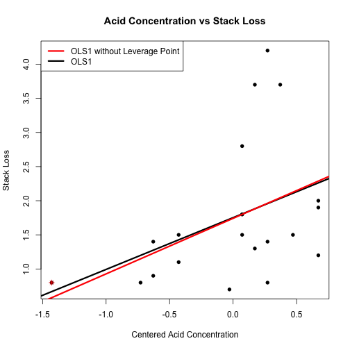

### Observation:

In the above summary, we can see that the slope has increased after
removing the point of leverage which means that it was bringing down the
slope of the regression line.

### 1 e) Bootstrap Standard Error and 95% Confidence Interval


```r
set.seed(42)
bootLS <- function(x,y,conf=0.95,B=1000) {
  
  N = length(x)
  
  # fit the linear model
  fit = lm(y~x)
  beta0 = fit$coefficients[1]
  beta1 = fit$coefficients[2]
  sebeta0=summary(fit)$coefficients[,2][1]
  sebeta1=summary(fit)$coefficients[,2][2]
  
  beta0_boot = rep(NA,B)
  beta1_boot = rep(NA,B)
  t0_boot = rep(NA,B)
  t1_boot = rep(NA,B)
  

  for (i in 1:B){
    indices = sample(1:N,N,replace=TRUE)
    x_boot = x[indices]
    y_boot = y[indices]
    fit_boot=lm(y_boot~x_boot)
    beta0_boot[i] = fit_boot$coefficients[1]
    beta1_boot[i] = fit_boot$coefficients[2]
    sebeta0_boot = summary(fit_boot)$coefficients[,2][1]
    sebeta1_boot = summary(fit_boot)$coefficients[,2][2]
    t0_boot[i]=(beta0_boot[i]-beta0)/(sebeta0_boot)
    t1_boot[i]=(beta1_boot[i]-beta1)/(sebeta1_boot)
  }
  
  boot_slp = matrix(c(beta1 + quantile(t1_boot,c((1-conf)/2,(1+conf)/2))*sebeta1),ncol = 2)
  colnames(boot_slp) = c(paste(toString((1-conf)*100/2),"%"),paste(toString((1+conf)*100/2),"%"))

  return(list("Standard OLS Confidence Interval"=confint(fit)[2,2]-confint(fit)[2,1],
           "Bootstrap COnfidence Interval" = boot_slp[2]-boot_slp[1], "Standard OLS Standard Error"=sebeta1,"Bootstrap Standard Error" = sd(beta1_boot)))
  
}

bootLS(stackloss_$Acid.Conc.c,stackloss_$Stack.Loss)
```

```
## $`Standard OLS Confidence Interval`
## [1] 1.670873
## 
## $`Bootstrap COnfidence Interval`
## [1] 1.199234
## 
## $`Standard OLS Standard Error`
##         x 
## 0.3991529 
## 
## $`Bootstrap Standard Error`
## [1] 0.2942717
```

### Observation:

Our original dataset is very small with just 21 observations here.
Therefore, the Standard OLS might not be able to accurately estimate the
coefficients. Using Bootstrap, we can actually resample our data and it
can in effect help us capture the model variability and estimate the
coefficients more accurately. In the above case, we can see that
Bootstrap Confidence Interval has become narrower and the Standard Error
has also decreased, which shows that it has helped to reduce the
sampling variability of the estimates.

## Problem 2:

### Fitting a multiple regression model of Stack.Loss as a function of Air.Flow, Water.Temp and Acid.Conc


```r
mlm = lm(Stack.Loss~Air.Flow+Water.Temp+Acid.Conc,data=stackloss_)
summary(mlm)
```

```
## 
## Call:
## lm(formula = Stack.Loss ~ Air.Flow + Water.Temp + Acid.Conc, 
##     data = stackloss_)
## 
## Residuals:
##      Min       1Q   Median       3Q      Max 
## -0.72377 -0.17117 -0.04551  0.23614  0.56978 
## 
## Coefficients:
##             Estimate Std. Error t value Pr(>|t|)    
## (Intercept)  3.61416    8.90213   0.406  0.68982    
## Air.Flow     0.07156    0.01349   5.307  5.8e-05 ***
## Water.Temp   0.12953    0.03680   3.520  0.00263 ** 
## Acid.Conc   -0.15212    0.15629  -0.973  0.34405    
## ---
## Signif. codes:  0 '***' 0.001 '**' 0.01 '*' 0.05 '.' 0.1 ' ' 1
## 
## Residual standard error: 0.3243 on 17 degrees of freedom
## Multiple R-squared:  0.9136,	Adjusted R-squared:  0.8983 
## F-statistic:  59.9 on 3 and 17 DF,  p-value: 3.016e-09
```

### 2 a) Model Assumptions on Multivariate Model


```r
plot(mlm,which=1)
```

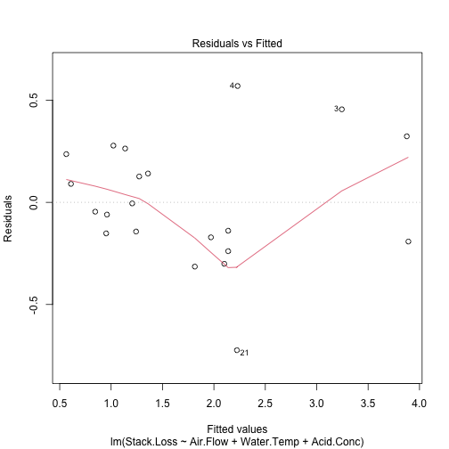


```r
residualPlots(mlm)
```

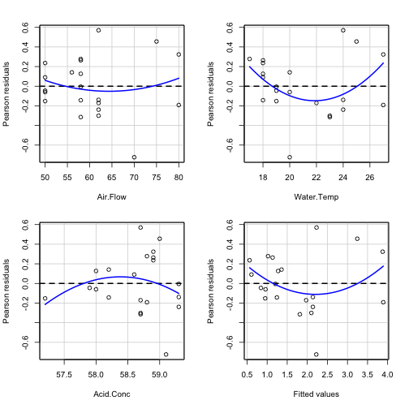

```
##            Test stat Pr(>|Test stat|)  
## Air.Flow      0.7594          0.45866  
## Water.Temp    2.1794          0.04459 *
## Acid.Conc    -1.0038          0.33040  
## Tukey test    1.5033          0.13277  
## ---
## Signif. codes:  0 '***' 0.001 '**' 0.01 '*' 0.05 '.' 0.1 ' ' 1
```


```r
qqPlot(mlm$residuals)
```

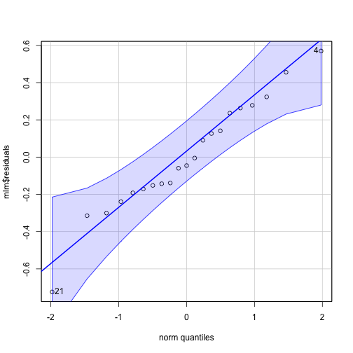

```
## [1] 21  4
```

### Observation:

In the above plots, I have observed the following: 1. Mean Zero: Here we
can see that the mean zero assumption is being violated and this can
lead to biased coefficient estimates and therefore we cannot trust the
conclusions derived from the model. 2. Homoscedasticity: As we can see
that the variance is not constant in the plot of residual vs predicted
values, the homoscedasticity assumption is being violated here. This can
also lead to biased coefficients which make the model highly inaccurate.
3. Normality: In the qqplot, we can observe that the residuals seem to
be normally distributed and but as out first assumption itself was
violated and therefore could have led to biased estimated coefficients.
This in turn would have affected the normality of the residuals and
therefore we cannot actually trust this evidence.

### 2 b) Evaluating the Multicolinearity between predictors


```r
vif(mlm)
```

```
##   Air.Flow Water.Temp  Acid.Conc 
##   2.906484   2.572632   1.333587
```


```r
plot(vif(mlm), type='h', col=4, lwd=3)
abline(h = 5, lty=2)
```

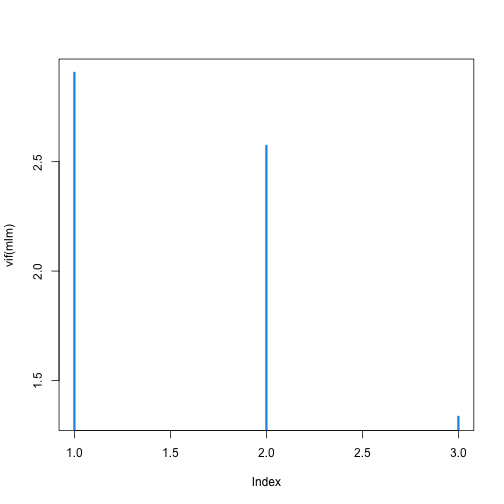

Air.Flow has the highest VIF within the three predictors, stating that
it's Variance is the most explained by other predictors in the model.


```r
corr = cor(stackloss_[c("Air.Flow","Water.Temp","Acid.Conc")])
corrplot.mixed(corr)
```

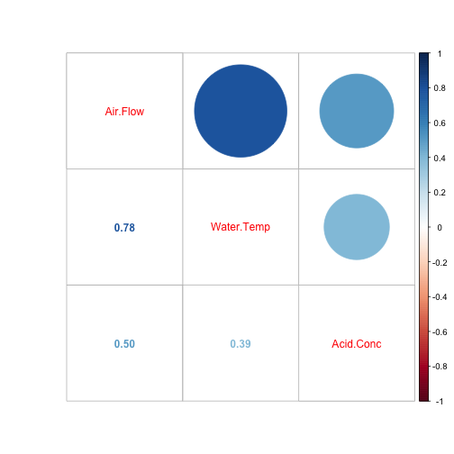

### Observation:

The correlation plot supports the vif evidence on Air.Flow and we can
see that Air.Flow is highly correlated with Water.Temp. And thought the
correlation with Acid.Conc is not higher that 0.5 but it is still
correlated. This shows that the model has multicolinearity and the
estimated coefficients may be inaccurate and difficult to interpret. To
tackle this we need to to variable selection and keep the most relevant
predictors in the model.

### 2 c) Using Cp to choose the best Regression Predictor Subset


```r
dat_x = stackloss_[,c('Air.Flow','Water.Temp','Acid.Conc')]
dat_y = stackloss_[,c('Stack.Loss')]

test <- regsubsets(dat_x,dat_y,method="backward",intercept=TRUE)
sum_ = summary(test)
best_model_index = which.min(sum_$cp)
best_model <- sum_$which[best_model_index, ]
predictors <- colnames(sum_$which)[-1]
selected_predictors <- predictors[best_model[-1]]
selected_predictors
```

```
## [1] "Air.Flow"   "Water.Temp"
```

The selected predictors from the best regression subset are Air.Flow and
Water.Temp

### 2 c) Using Cp to choose the best subset LASSO fit


```r
fit = lm(dat_y~.,data=dat_x)
lasso.fit = lars(x = model.matrix(fit)[,-1], y = dat_y, normalize=FALSE, intercept=TRUE)
plot(lasso.fit, lwd=2)
```

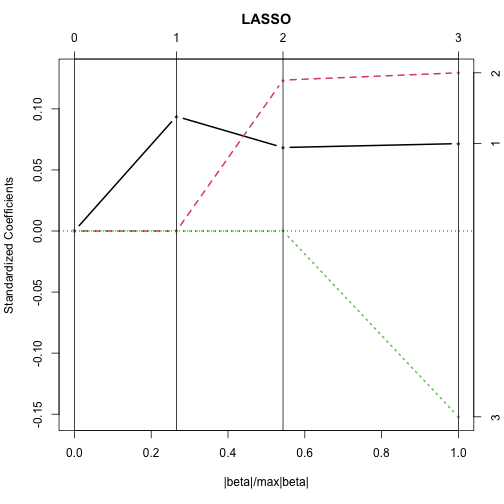


```r
lasso_pred = coef(lasso.fit, s=which.min(lasso.fit$Cp), mode="step")
names(lasso_pred[lasso_pred>0])
```

```
## [1] "Air.Flow"   "Water.Temp"
```

The selected predictors from the best regression subset are Air.Flow and
Water.Temp.

### Observation:

In this case, both the mehtods are suggesting the same subset of
predictors which shows that these two are quite significant.

## Problem 3:

### 3 a) Function to perform Backward Variable Selection


```r
BackwardPath <- function(x, y) {
  p <- ncol(x)

  remaining <- names(x)
  model_aic <- list()
  model_formula <- list()
  model_coeff <- list()
  
  full_model <- lm(y~.,data=data.frame(x,y))
  model_aic[[1]] <- AIC(full_model)
  model_formula[[1]] <- formula(full_model)
  model_coeff[[1]] <- full_model$coefficients
  
  while(length(remaining)>1){
    best_model <- NULL
    best_aic <- Inf
    
    for (i in remaining){
      predictors <- remaining[-which(remaining == i)]
      formula <- paste("y ~ ", paste(predictors, collapse = "+"))
      model <- lm(formula,data=data.frame(x,y))
      aic <- AIC(model)
      if (aic < best_aic){
        best_aic <- aic
        best_model <- model
      }
    }
    
    remaining <- remaining[remaining %in% labels(terms(formula(best_model)))]
    idx = p+1-length(remaining)
    model_aic[[idx]] <- best_aic
    model_formula[[idx]] <- formula(best_model)
    model_coeff[[idx]] <- best_model$coefficients 
  }
  
  null_model <- lm(y~1,data=data.frame(x,y))
  model_aic[[p+1]] <- AIC(null_model)
  model_formula[[p+1]] <- formula(null_model)
  model_coeff[[p+1]] <- null_model$coefficients
  
  return(list("Model" = model_formula,"Coefficients" = model_coeff,"AIC"=model_aic))
}
```

### 3 b) Function to produce plots for the above function's output


```r
BackwardVisualize <- function(coeffPath) {
  coeff_ = bind_rows(coeffPath["Coefficients"][[1]]) %>% replace(is.na(.), 0)

  preds = colnames(coeff_)[-1]
  
  coeff_["no_pred"] = c((ncol(coeff_)-1):0)
  r = max(abs(coeff_[preds]))
  
  col = rainbow((length(preds)+2))
  par(mfrow = c(2, 1))
  plot(coeff_$no_pred,unname(unlist(coeff_[2])),type = "o", col = col[2],ylim = c(-r, r),xlab="No of Predictors",ylab="Estimated Coefficients",pch=1,lwd=2)
  for (i in 3:(length(preds)+1)){
    lines(coeff_$no_pred,unname(unlist(coeff_[i])), type = "o", col = col[i],lwd=2,pch=1)
  }
  
  legend("bottomleft",legend=preds, col=col[2:(length(preds)+1)],lwd=2,pch=1)
  
  plot(x=(length(preds)):0,unlist(coeffPath["AIC"][[1]]),type="o",xlab="No of Predictors",ylab="AIC",pch=1,lwd=2,cex=0.8)
}
```

### 3 c) Applying the functions to the Stackloss dataset


```r
dat_x = stackloss_[,c('Air.Flow','Water.Temp','Acid.Conc')]
dat_y = stackloss_[,c('Stack.Loss')]
coeffPath = BackwardPath(dat_x,dat_y)
BackwardVisualize(coeffPath)
```

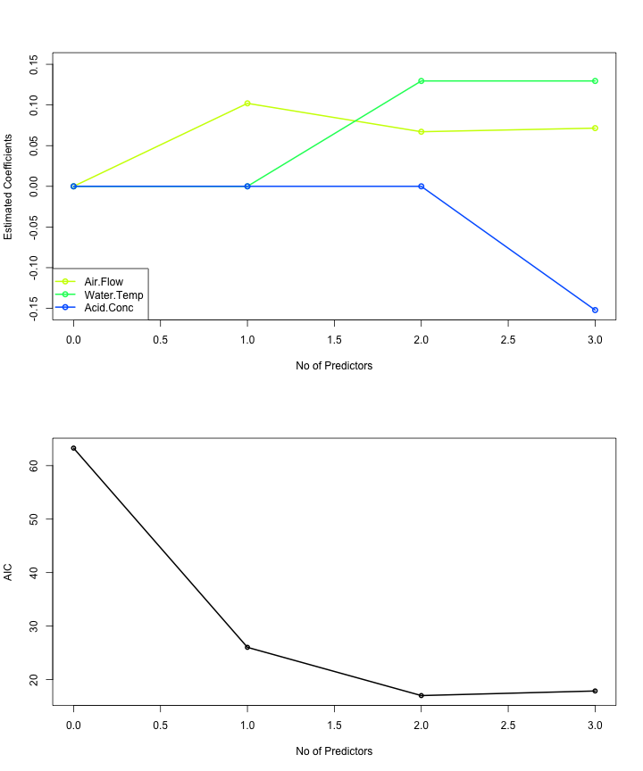


```r
best_model = which.min(coeffPath["AIC"][[1]])
best_model_coeff = coeffPath["Coefficients"][[1]][best_model]
best_model_coeff
```

```
## [[1]]
## (Intercept)    Air.Flow  Water.Temp 
## -5.03588401  0.06711544  0.12953514
```

### Observation:

Using backward selection, we are getting Air.Flow and Water.Temp as the
best subset regression predictors which is same as 2 c). This gives us
more evidence on the significance of these two predictors.

## Problem 4:

### 4 a) Generating Random Predictors for Stackloss data and fitting a multiple regression model on it


```r
set.seed(1)
dat_x = stackloss_[,c('Air.Flow','Water.Temp','Acid.Conc')]
dat_y = stackloss_[,c('Stack.Loss')]
n <- nrow(dat_x)
dat_x["x1"] = runif(n,min=-1,max=1)
dat_x["x2"] = runif(n,min=-1,max=1)
dat_x["x3"] = runif(n,min=-1,max=1)
dat_x["x4"] = runif(n,min=-1,max=1)
dat_x["x5"] = runif(n,min=-1,max=1)
```

### 4 b) Using Cp to find best subset regression model


```r
test <- regsubsets(dat_x,dat_y,method="backward",intercept=TRUE)
sum_ = summary(test)
best_model_index = which.min(sum_$cp)
best_model <- sum_$which[best_model_index, ]
predictors <- colnames(sum_$which)[-1]
selected_predictors <- predictors[best_model[-1]]
selected_predictors
```

```
## [1] "Air.Flow"   "Water.Temp" "x5"
```

### 4 b) Using Cp to find best subset LASSO model


```r
fit = lm(dat_y~.,data=dat_x)
lasso.fit = lars(x = model.matrix(fit)[,-1], y = dat_y, normalize=FALSE, intercept=TRUE)
plot(lasso.fit, lwd=2)
```

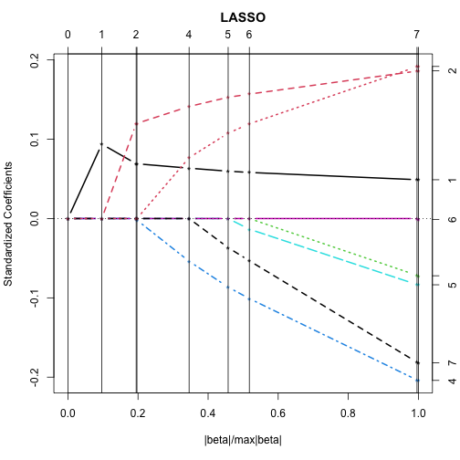


```r
lasso_pred = coef(lasso.fit, s=which.min(lasso.fit$Cp), mode="step")
names(lasso_pred[lasso_pred>0])
```

```
## [1] "Air.Flow"   "Water.Temp"
```

### 4 b) Using the Backward Selection method to find the best subset regression model


```r
coeffPath = BackwardPath(dat_x,dat_y)
BackwardVisualize(coeffPath)
```

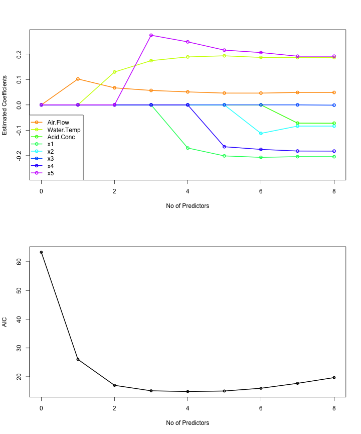


```r
best_model = which.min(coeffPath["AIC"][[1]])
best_model_coeff = coeffPath["Coefficients"][[1]][best_model]
best_model_coeff
```

```
## [[1]]
## (Intercept)    Air.Flow  Water.Temp          x1          x5 
##  -5.3027967   0.0511140   0.1889124  -0.1698089   0.2482353
```

### Observation:

After adding the random variable, we are getting the following
results: 1. Best Regression Subset Predictors: Air.Flow, Water.Temp, x5
2. Best Subset LASSO fit: Air.Flow, Water.Temp 3. Best Backward
Selection Subset: Air.Flow, Water.Temp, x1, x5

We can see that adding junk variables has affected 1st and 3rd Methods
but not lasso.

### 4 c) Repeating the above simulation 100 times and finding best subsets using all three methods


```r
selected_pred_reg = c()
selected_pred_lasso = c()
selected_pred_back = c()
dat_x = stackloss_[,c('Air.Flow','Water.Temp','Acid.Conc')]
dat_y = stackloss_[,c('Stack.Loss')]
for (i in 1:100){
  n <- nrow(dat_x)
  dat_x["x1"] = runif(n,min=-1,max=1)
  dat_x["x2"] = runif(n,min=-1,max=1)
  dat_x["x3"] = runif(n,min=-1,max=1)
  dat_x["x4"] = runif(n,min=-1,max=1)
  dat_x["x5"] = runif(n,min=-1,max=1)
  
  fit = lm(dat_y~.,data=dat_x)
  lasso.fit = lars(x = model.matrix(fit)[,-1], y = dat_y, normalize=FALSE, intercept=TRUE)
  lasso_pred = coef(lasso.fit, s=which.min(lasso.fit$Cp), mode="step")
  selected_pred_lasso <- c(selected_pred_lasso,names(lasso_pred[lasso_pred>0]))
  
  test <- regsubsets(dat_x,dat_y,method="backward",intercept=TRUE)
  sum_ = summary(test)
  best_model_index = which.min(sum_$cp)
  best_model <- sum_$which[best_model_index, ]
  predictors <- colnames(sum_$which)[-1]
  selected_predictors <- predictors[best_model[-1]]
  selected_pred_reg <- c(selected_pred_reg,selected_predictors)
  
  coeffPath = BackwardPath(dat_x,dat_y)
  best_model = which.min(coeffPath["AIC"][[1]])
  best_model_coeff = coeffPath["Coefficients"][[1]][best_model]
  selected_pred_back <- c(selected_pred_back,unlist(names(best_model_coeff[[1]])[-1]))
}
```


```r
table(selected_pred_lasso)/100
```

```
## selected_pred_lasso
##   Air.Flow Water.Temp         x1         x2         x3         x4         x5 
##       1.00       1.00       0.09       0.06       0.07       0.13       0.06
```

```r
table(selected_pred_reg)/100
```

```
## selected_pred_reg
##  Acid.Conc   Air.Flow Water.Temp         x1         x2         x3         x4 
##       0.07       1.00       1.00       0.18       0.17       0.13       0.21 
##         x5 
##       0.19
```

```r
table(selected_pred_back)/100
```

```
## selected_pred_back
##  Acid.Conc   Air.Flow Water.Temp         x1         x2         x3         x4 
##       0.19       1.00       1.00       0.28       0.30       0.25       0.28 
##         x5 
##       0.25
```

### Observation:

Here we can see that adding the junk variables has in fact affected the
variable selection. But we can see that it has affected Lasso the least
and backward selected the most. We can say that Lasso is very effective
in identifying the important variables.
