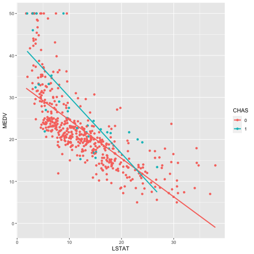

# Anova, F-Test, Hypothesis Test and Polynomial Regression


# Reading Data


```r
library(MASS)
data <- Boston[,names(Boston) %in% c("lstat","chas","rad","medv")]
data = data[complete.cases(data),]
data$chas = as.factor(data$chas)
data$rad = as.factor(data$rad)
```

# CHAS vs MEDV

```r
boxplot(data$medv ~ data$chas,ylab='MEDV', xlab='CHAS', lwd=2, pch = 16)
```


From the box plot it is clear that the houses in the area which borders Charles River have high Median Value compared to the houses in the area which do not border Charles River.

The boxes for the houses near the river also have a higher range of values, which suggests that there is more variability in the median values of houses near the river.

The box plot describes the spread of the data in each category of Chas. The box plot of Chas 0 shows that there are outliers (lying outside the quantile range).

The boxes for the houses near the river also have a higher range of values, which suggests that there is more variability in the median values of houses near the river.


```r
fit = lm(data$medv ~ data$chas)
summary(fit)
```

```
## 
## Call:
## lm(formula = data$medv ~ data$chas)
## 
## Residuals:
##     Min      1Q  Median      3Q     Max 
## -17.094  -5.894  -1.417   2.856  27.906 
## 
## Coefficients:
##             Estimate Std. Error t value Pr(>|t|)    
## (Intercept)  22.0938     0.4176  52.902  < 2e-16 ***
## data$chas1    6.3462     1.5880   3.996 7.39e-05 ***
## ---
## Signif. codes:  0 '***' 0.001 '**' 0.01 '*' 0.05 '.' 0.1 ' ' 1
## 
## Residual standard error: 9.064 on 504 degrees of freedom
## Multiple R-squared:  0.03072,	Adjusted R-squared:  0.02879 
## F-statistic: 15.97 on 1 and 504 DF,  p-value: 7.391e-05
```

```r
anova(fit)
```

```
## Analysis of Variance Table
## 
## Response: data$medv
##            Df Sum Sq Mean Sq F value    Pr(>F)    
## data$chas   1   1312 1312.08  15.972 7.391e-05 ***
## Residuals 504  41404   82.15                      
## ---
## Signif. codes:  0 '***' 0.001 '**' 0.01 '*' 0.05 '.' 0.1 ' ' 1
```
The F-test here is testing if the Chas variable is significant or not. 
Null hypothesis: Chas Variable is not significant
Alternate Hypothesis: Char Variable is significant

The p-value for the f-test is 0.0000739, which is significantly lower, therefore, we can reject the null hypothesis. This implies that the Chas variable is indeed significant.
———
In the summary of the model, we can see the same p-value for chas1 variable. As the value is significantly lower, we can assume that the point estimates are correct. 

The summary shows that the point estimate is 6.3462 ($6346.2)  higher in favor of Chas 1 (Houses in the area that border Charles river) compared to Chas 0 (Houses in the area that do not border Charles river).

This perfectly aligns with the results we got from the box plots.

# RAD vs MEDV

```r
boxplot(data$medv ~ data$rad,ylab='MEDV', xlab='RAD', lwd=2, pch = 16)
```


From the box plot, we can see that the median values for rad=4, rad = 6 and rad =24 are comparatively lower than the rest.

We can observe outliers in rad = 1,4,5,7 and 24

```r
fit = lm(data$medv ~ data$rad)
summary(fit)
```

```
## 
## Call:
## lm(formula = data$medv ~ data$rad)
## 
## Residuals:
##     Min      1Q  Median      3Q     Max 
## -14.387  -5.280  -1.732   3.175  33.596 
## 
## Coefficients:
##             Estimate Std. Error t value Pr(>|t|)    
## (Intercept)   24.365      1.821  13.383  < 2e-16 ***
## data$rad2      2.468      2.465   1.001   0.3172    
## data$rad3      3.564      2.249   1.584   0.1137    
## data$rad4     -2.978      1.979  -1.504   0.1331    
## data$rad5      1.342      1.973   0.680   0.4966    
## data$rad6     -3.388      2.422  -1.399   0.1624    
## data$rad7      2.741      2.686   1.020   0.3080    
## data$rad8      5.993      2.465   2.431   0.0154 *  
## data$rad24    -7.961      1.954  -4.075 5.36e-05 ***
## ---
## Signif. codes:  0 '***' 0.001 '**' 0.01 '*' 0.05 '.' 0.1 ' ' 1
## 
## Residual standard error: 8.142 on 497 degrees of freedom
## Multiple R-squared:  0.2287,	Adjusted R-squared:  0.2162 
## F-statistic: 18.42 on 8 and 497 DF,  p-value: < 2.2e-16
```

```r
anova(fit)
```

```
## Analysis of Variance Table
## 
## Response: data$medv
##            Df Sum Sq Mean Sq F value    Pr(>F)    
## data$rad    8   9767  1220.9  18.416 < 2.2e-16 ***
## Residuals 497  32949    66.3                      
## ---
## Signif. codes:  0 '***' 0.001 '**' 0.01 '*' 0.05 '.' 0.1 ' ' 1
```
The F-test here is testing if the rad variable is significant or not. 
Null hypothesis: rad Variable is not significant
Alternate Hypothesis: rad Variable is significant

The p-value for the f-test is 2.2e-16, which is significantly lower, therefore, we can reject the null hypothesis. This implies that the rad variable is indeed significant.
———
In the summary of the model, we can see the same p-value for rad variable. As the value is significantly lower, we can assume that the point estimates are correct. 

The summary shows that the point estimate with respect to rad=0. We can see that rad4, rad6 and rad24 have lower point estimates compared to rad0 and rest have higher. 

This perfectly aligns with the box plots

# RAD*CHAS vs MEDV

```r
boxplot(data$medv ~ data$rad*data$chas,ylab='MEDV', xlab='RAD*CHAS', lwd=2, pch = 16)
```


```r
interaction.plot(data$rad, data$chas, data$medv, col=2:4, lwd=2, cex.axis=1, cex.lab=1)
```


```r
fit = lm(data$medv ~ data$chas*data$rad)
summary(fit)
```

```
## 
## Call:
## lm(formula = data$medv ~ data$chas * data$rad)
## 
## Residuals:
##     Min      1Q  Median      3Q     Max 
## -15.505  -5.089  -1.339   3.512  34.561 
## 
## Coefficients: (3 not defined because of singularities)
##                       Estimate Std. Error t value Pr(>|t|)    
## (Intercept)             23.016      1.794  12.829  < 2e-16 ***
## data$chas1              26.984      8.023   3.363 0.000830 ***
## data$rad2                3.818      2.401   1.590 0.112534    
## data$rad3                4.912      2.217   2.215 0.027209 *  
## data$rad4               -1.976      1.954  -1.011 0.312483    
## data$rad5                2.505      1.951   1.284 0.199702    
## data$rad6               -2.039      2.360  -0.864 0.388087    
## data$rad7                4.090      2.611   1.567 0.117833    
## data$rad8                8.489      2.537   3.346 0.000882 ***
## data$rad24              -7.577      1.927  -3.933  9.6e-05 ***
## data$chas1:data$rad2        NA         NA      NA       NA    
## data$chas1:data$rad3   -26.962      9.831  -2.743 0.006318 ** 
## data$chas1:data$rad4   -22.212      8.521  -2.607 0.009422 ** 
## data$chas1:data$rad5   -25.042      8.397  -2.982 0.003005 ** 
## data$chas1:data$rad6        NA         NA      NA       NA    
## data$chas1:data$rad7        NA         NA      NA       NA    
## data$chas1:data$rad8   -32.489      8.934  -3.637 0.000305 ***
## data$chas1:data$rad24  -11.060      8.515  -1.299 0.194581    
## ---
## Signif. codes:  0 '***' 0.001 '**' 0.01 '*' 0.05 '.' 0.1 ' ' 1
## 
## Residual standard error: 7.82 on 491 degrees of freedom
## Multiple R-squared:  0.2971,	Adjusted R-squared:  0.2771 
## F-statistic: 14.82 on 14 and 491 DF,  p-value: < 2.2e-16
```

```r
anova(fit)
```

```
## Analysis of Variance Table
## 
## Response: data$medv
##                     Df  Sum Sq Mean Sq F value    Pr(>F)    
## data$chas            1  1312.1 1312.08 21.4563 4.642e-06 ***
## data$rad             8  9458.3 1182.29 19.3339 < 2.2e-16 ***
## data$chas:data$rad   5  1920.6  384.13  6.2816 1.156e-05 ***
## Residuals          491 30025.2   61.15                      
## ---
## Signif. codes:  0 '***' 0.001 '**' 0.01 '*' 0.05 '.' 0.1 ' ' 1
```
From the box plot, we can see that the mean of median values for 
rad=3 is equal for both chas0 and chas1, 
rad = 4, rad = 5 and rad =24 chas1 is higher than chas0
rad=8 chas0 is higher than chas1

We can observe the same thing through the interaction plot as well

The F-tests is testing the hypothesis that the corresponding coefficients are zero, which would imply that the corresponding variable has no effect on medv.

The first f-test is testing the significance of only chas
The second f-test is testing the significance of only rad
The third f-test is testing the significance of the interaction between chas and rad.

All the f-tests have significantly lower p-value, which means that the variables aree indeed significant.

The point estimates from the summary of the model align with the box plots

# LSTAT vs MEDV


```r
library(ggplot2)
ggplot(Boston, aes(x = lstat, y = medv, color = factor(chas))) +
  geom_point() +
  geom_smooth(method = "lm", se = FALSE) +
  labs(x = "LSTAT", y = "MEDV") +
  scale_color_discrete(name = "CHAS")
```



Null Hypothesis : The slopes of the medv-lstat relationship are equal for both Chas 0 and Chas 1
Alternative Hypothesis : The slopes of the medv-lstat relationship are not equal for Chas 0 and Chas 1

From the scatterplot, you can observe that the relationship between medv and lstat appears to be similar
for both Chas 0 and Chas 1

A significantly lower p-value would indicate that the null hypothesis can be rejected, and that the rate of decrease in median property value does depend on whether the area borders the Charles River


```r
fit0 <- lm(data$medv ~ data$chas*data$lstat)
fit1 <- lm(data$medv ~ data$lstat)

anova(fit1,fit0)
```

```
## Analysis of Variance Table
## 
## Model 1: data$medv ~ data$lstat
## Model 2: data$medv ~ data$chas * data$lstat
##   Res.Df   RSS Df Sum of Sq      F    Pr(>F)    
## 1    504 19472                                  
## 2    502 18418  2    1054.3 14.368 8.552e-07 ***
## ---
## Signif. codes:  0 '***' 0.001 '**' 0.01 '*' 0.05 '.' 0.1 ' ' 1
```

We can conclude that the rate of decrease of medv with respect to lstat depends on whether chas. Since the interaction term between lstat and chas is significant, it means that the rate of decrease indeed depends on chas. 

'''
# Polynomial Regression


```r
library(MASS)
library(quantreg)
data(Boston)
data <- Boston[,names(Boston) %in% c("lstat","medv")]
tmp = data[,c("medv","lstat")] 
tmp = tmp[complete.cases(tmp),]
tmp = as.data.frame(tmp)
names(tmp) = c("medv","lstat")
data = tmp
attach(data)
```
## (a) Fitting a polynomial model of degree 3 by least squares.

```r
#least squares:
fit = lm(medv ~ poly(lstat, 3))
summary(fit)
```

```
## 
## Call:
## lm(formula = medv ~ poly(lstat, 3))
## 
## Residuals:
##      Min       1Q   Median       3Q      Max 
## -14.5441  -3.7122  -0.5145   2.4846  26.4153 
## 
## Coefficients:
##                  Estimate Std. Error t value Pr(>|t|)    
## (Intercept)       22.5328     0.2399  93.937  < 2e-16 ***
## poly(lstat, 3)1 -152.4595     5.3958 -28.255  < 2e-16 ***
## poly(lstat, 3)2   64.2272     5.3958  11.903  < 2e-16 ***
## poly(lstat, 3)3  -27.0511     5.3958  -5.013 7.43e-07 ***
## ---
## Signif. codes:  0 '***' 0.001 '**' 0.01 '*' 0.05 '.' 0.1 ' ' 1
## 
## Residual standard error: 5.396 on 502 degrees of freedom
## Multiple R-squared:  0.6578,	Adjusted R-squared:  0.6558 
## F-statistic: 321.7 on 3 and 502 DF,  p-value: < 2.2e-16
```
## (b) Fitting a polynomial model of degree 3 by robust regression models. 

```r
#least absolute regression:
m.lar = rq(medv ~ poly(lstat, 3))
summary(m.lar)
```

```
## 
## Call: rq(formula = medv ~ poly(lstat, 3))
## 
## tau: [1] 0.5
## 
## Coefficients:
##                 coefficients lower bd   upper bd  
## (Intercept)       21.44583     21.10727   22.06917
## poly(lstat, 3)1 -137.62436   -152.23491 -123.42122
## poly(lstat, 3)2   44.03688     38.05664   65.28219
## poly(lstat, 3)3  -16.30155    -26.38196   -2.35653
```

```r
#Huber’s M-estimation:
m.huber = rlm(medv ~ poly(lstat, 3),psi = psi.huber)
summary(m.huber)
```

```
## 
## Call: rlm(formula = medv ~ poly(lstat, 3), psi = psi.huber)
## Residuals:
##      Min       1Q   Median       3Q      Max 
## -13.8373  -3.0157  -0.2219   2.7329  26.8409 
## 
## Coefficients:
##                 Value     Std. Error t value  
## (Intercept)       21.9774    0.2037   107.8773
## poly(lstat, 3)1 -143.0378    4.5827   -31.2126
## poly(lstat, 3)2   55.9111    4.5827    12.2005
## poly(lstat, 3)3  -21.7848    4.5827    -4.7537
## 
## Residual standard error: 4.323 on 502 degrees of freedom
```

```r
#Hampel’s M-estimation:
m.hampel = rlm(medv ~ poly(lstat, 3),psi = psi.hampel)
summary(m.hampel)
```

```
## 
## Call: rlm(formula = medv ~ poly(lstat, 3), psi = psi.hampel)
## Residuals:
##      Min       1Q   Median       3Q      Max 
## -14.0819  -3.3423  -0.3086   2.6869  26.7536 
## 
## Coefficients:
##                 Value     Std. Error t value  
## (Intercept)       22.2032    0.2161   102.7330
## poly(lstat, 3)1 -147.0125    4.8616   -30.2395
## poly(lstat, 3)2   60.7791    4.8616    12.5019
## poly(lstat, 3)3  -25.7454    4.8616    -5.2957
## 
## Residual standard error: 4.547 on 502 degrees of freedom
```

```r
#Tukey Bisquare M-estimation:
m.bisquare = rlm(medv ~ poly(lstat, 3),psi = psi.bisquare)
summary(m.bisquare)
```

```
## 
## Call: rlm(formula = medv ~ poly(lstat, 3), psi = psi.bisquare)
## Residuals:
##      Min       1Q   Median       3Q      Max 
## -13.4084  -2.7037  -0.1377   2.9575  27.0035 
## 
## Coefficients:
##                 Value     Std. Error t value  
## (Intercept)       21.6329    0.1962   110.2426
## poly(lstat, 3)1 -134.8470    4.4141   -30.5493
## poly(lstat, 3)2   48.3681    4.4141    10.9577
## poly(lstat, 3)3  -15.4625    4.4141    -3.5030
## 
## Residual standard error: 4.172 on 502 degrees of freedom
```

```r
#Least median of squares
m.lms = lmsreg(medv ~ poly(lstat, 3))
m.lms$coefficients
```

```
##     (Intercept) poly(lstat, 3)1 poly(lstat, 3)2 poly(lstat, 3)3 
##        19.39161       -87.66264       -13.98135        27.16903
```

```r
#Least trimmed sum of squares
m.lts = ltsreg(medv ~ poly(lstat, 3))
m.lts$coefficients
```

```
##     (Intercept) poly(lstat, 3)1 poly(lstat, 3)2 poly(lstat, 3)3 
##       19.822347      -88.969364        3.607379       27.826536
```
## (c) Scatterplot with an overlay of all the above fits. 

```r
plot(lstat, medv, pch = 16)
pts = seq(min(lstat), max(lstat), len=100)

val = predict(fit, data.frame(lstat = pts))
lines(pts, val, col="blue", lwd = 3)

val = predict(m.lar, data.frame(lstat = pts))
lines(pts, val, col="red", lwd = 3)

val = predict(m.huber, data.frame(lstat = pts))
lines(pts, val, col="green", lwd = 3)

val = predict(m.hampel, data.frame(lstat = pts))
lines(pts, val, col="cyan", lwd = 3)

val = predict(m.bisquare, data.frame(lstat = pts))
lines(pts, val, col="yellow", lwd = 3)

val = predict(m.lms, data.frame(lstat = pts))
lines(pts, val, col="deeppink", lwd = 3)

val = predict(m.lts, data.frame(lstat = pts))
lines(pts, val, col="lightblue", lwd = 3)

legend(x="topright", legend=c("Least squares", "Least absolute regression",
                              "Huber’s M-estimation", "Hampel’s M-estimation",
                              "Tukey Bisquare M-estimation","Least median of squares",
                              "Least trimmed sum of squares"),
       col=c("blue","red","green","cyan","yellow","deeppink","lightblue"), 
       lty=1,lwd=3, cex=0.8)
```


__Observations:__ The least squares, least absolute regression and the M-estimation methods show similar results compared to least median of squares and least trimmed sum of squares. Compared to the remaining models, the least median of squares and least trimmed sum of squares estimates of the first degree coefficient is larger and the estimates of the second degree coefficient is smaller. Whereas for the third degree coefficient, least squares estimate of the coefficient is the lowest and least trimmed sum of squares estimate is the highest.
