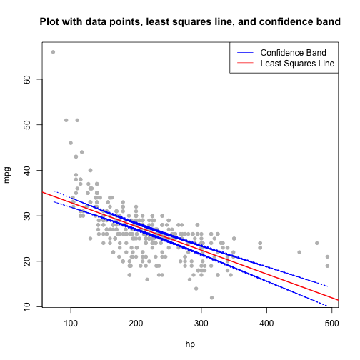

# Confidence Band for Linear Regression


## Loading the data


```r
load("data/04cars.rda")
```

## Extracting required variables

```r
tmp = dat[,c(13,15)] # extract variables hp and mpg
tmp = tmp[complete.cases(tmp),] # extract complete cases
tmp = as.data.frame(tmp)
names(tmp) = c("hp","mpg") # abbreviate names
dat = tmp
str(dat)
```

```
## 'data.frame':	414 obs. of  2 variables:
##  $ hp : num  103 103 140 140 140 132 132 130 110 130 ...
##  $ mpg: num  34 34 37 37 37 36 36 33 36 33 ...
```


```r
head(dat)
```

```
##    hp mpg
## 1 103  34
## 2 103  34
## 3 140  37
## 4 140  37
## 5 140  37
## 6 132  36
```

## confBand function returns a plot with the points (x1, y1), . . . , (xn, yn), the least squares line, and the confidence band at level conf

```r
confBand <- function(x,y,conf=0.95) {
    n = length(y)
    p = 1
    X = model.matrix(~x)
    Xt=t(X) # transpose of X matrix: X(t)
    A=Xt%*%X # X(t)X
    B=Xt%*%y # X(t)Y
    Ainv=solve(A) # inverse of X(t)X
    beta=Ainv%*%B # least squares coefficient
    y_hat = X %*% beta
    sig = (sum((y - y_hat)^2)/(n-p-1))^0.5 # mean squared error
    fd = (qf(df1 = (p+1), df2 = (n-p-1),p=conf)) # F distribution with _p+1_
    # and _n-p+1_ degrees of freedom
    se = sig*diag(X %*% solve(t(X) %*% X) %*% t(X))^0.5 # standard error
    up = y_hat + ((p+1)*fd)^0.5*se # upper confidence interval
    lo = y_hat - ((p+1)*fd)^0.5*se # lower confidence interval
    plot(x,y,col = 'gray',pch = 16,
    main="Plot with data points, least squares line, and confidence band",
    xlab = "hp", ylab = "mpg") # plot with the points (x1, y1), ... , (xn, yn)
    abline(beta[1],beta[2], col = 'red', lwd = 2) # least squares line
    lines(x, lo,lwd = 1.5, lty = 3, col = 'blue') # confidence band is the region
    lines(x, up,lwd = 1.5, lty = 3, col = 'blue') # between these two boundaries
    legend(x = "topright", col = c("blue", "red"), lty = 1, lwd = 1,
    legend = c('Confidence Band', 'Least Squares Line'))
}
```

## Applying the function to hp and mpg.


```r
confBand(dat$hp,dat$mpg)
```



## confInterval function returns the upper and lower confidence intervals. It uses the same equations as in confBand function to calculate the confidence interval.

```r
confInterval <- function(x,y,conf=0.95) {
    n = length(y)
    p = 1
    X = model.matrix(~x)
    Xt=t(X)
    A=Xt%*%X
    B=Xt%*%y
    Ainv=solve(A)
    beta=Ainv%*%B
    y_hat = X %*% beta
    sig = (sum((y - y_hat)^2)/(n-p-1))^0.5
    f = (qf(df1 = (p+1), df2 = (n-p-1),p=conf))
    se = sig*diag(X %*% solve(t(X) %*% X) %*% t(X))^0.5
    up = y_hat + ((p+1)*f)^0.5*se
    lo = y_hat - ((p+1)*f)^0.5*se
    return(list(lo,up))
}
```


```r
x <- runif(100, 0, 1) # x is i.i.d that follows a uniform distribution
y_true = 1 + x # true line equation
count = 0
N = 1000
```

## Simulating the experiment 1000 times

```r
for (j in 1:N) {
e = rnorm(100,mean = 0,sd = 0.2) # e is i.i.d following normal distribution
# with mean 0 and std 0.2
y = 1 + x + e
conf_int = data.frame(confInterval(x,y,conf=0.99)) # computing 99% confidence band
names(conf_int) = c("lwr","upr")
if(all(y_true >= conf_int$lwr & y_true <= conf_int$upr)) { # checking if true line is
# within the confidence band
count = count + 1
}
}
```

## Proportion of times (out of N) that the confidence band contained the true line.


```r
count/N
```

```
## [1] 0.995
```
