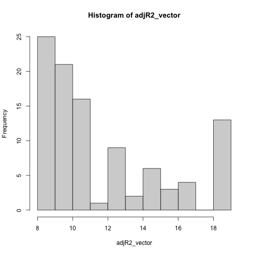
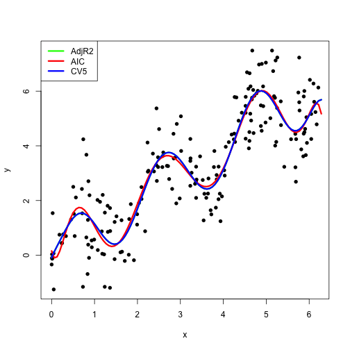

# Cross-validation and Sequential Model Selection for Linear Regression


Implementation of cv.lm(x, y, k). This function estimates the prediction error of the linear regression model with y as response using k-fold cross-validation.


```r
cv.lm <- function(x,y,k) { 
    if(length(x)==0){
        x <- rep(1,length(y))
    }

    x <- as.data.frame(x)
    y <- as.data.frame(y)
    n <- nrow(x)

    sample_n <- sample(n)
    x_cv <- as.data.frame(x[sample_n,])
    y_cv <- as.data.frame(y[sample_n,])
    folds <- cut(seq(1,n), breaks=k, labels=FALSE) 
    pred_error <- rep(NA,k)
    for(i in 1:k) {
        # Split data into training and validation sets
        x.train <- x_cv[folds != i,]
        y.train <- y_cv[folds != i,]
        x.test <- x_cv[folds == i,]
        y.test <- y_cv[folds == i,]
        
        # Fit a linear regression model on the training data
        fit <- lm(y.train ~ .,data=as.data.frame(x.train))
        
        # Predict the response variable for the validation set
        pred <- predict(fit, as.data.frame(x.test))
        res = (y.test - pred)
        
        # Calculate the root mean squared error of the prediction 
        pred_error[i] <- sqrt(mean(res^2))
    }
    # Return the mean of the root mean squared errors
    return(mean(pred_error))
}
```

Implementation of SequentialSelection(x, y, method). This function computes the forward selection path for linear regression from ‘intercept only’ to ‘full model’ like:
y~x1
y~x1 + x2
y~x1 + x2 + x3
and so on.
and chooses the model on that path using different criteria specified by ‘method’.


```r
SequentialSelection <- function(x, y, method) {
    # Set up variables and data structures
    n <- nrow(x)
    p <- ncol(x)
    scores <- vector(mode="numeric", length=p) 
    
    for(i in 1:p) {
        new.model <- lm(y ~ ., data=data.frame(x[,1:i]))
        
        # Calculate the score based on the specified method
        if(method == "AdjR2") {
            scores[i] <- summary(new.model)$adj.r.squared
        } else if(method == "AIC") { 
            scores[i] <- AIC(new.model)
        } else if(method == "CV5") { 
            scores[i] <- cv.lm(x[,1:i], y, 5)
        } 
    }

    if(method == "AdjR2") {
        best_model = which.max(scores)-1
    } else if(method == "AIC") { 
        best_model = which.min(scores)-1
    } else if(method == "CV5") { 
        best_model = which.min(scores)-1
    }
    
    return(best_model)
}
```

Fitting a polynomial model and performing simulations to compare the choice of degree by the sequential model selection methods defined above.


```r
adjR2_vector = c() 
aic_vector = c() 
cv5_vector = c() 

for (i in 1:100){
    n <- 200
    x <- runif(n, 0, 2*pi)
    y <- rnorm(n, mean = sin(3*x) + x, sd = 1)
    # Set the maximum degree
    max.degree <- 20
    # Generate the orthogonal polynomial basis functions
    x_poly <- data.frame(poly(x, degree = max.degree, raw = TRUE))
    adjR2_vector = c(adjR2_vector,SequentialSelection(x_poly,y,"AdjR2"))
    aic_vector = c(aic_vector,SequentialSelection(x_poly,y,"AIC"))
    cv5_vector = c(cv5_vector,SequentialSelection(x_poly,y,"CV5"))
}
```


```r
hist(adjR2_vector)
```



# Observation: For Adjusted R2, the chosen degree of polynomial is always 8 or greater


```r
hist(aic_vector)
```


# Observation: For AIC, the chosen degree of polynomial is always 8 or greater. The distribution is right skewed meaning it has high frequency for degrees 8 and 9.


```r
hist(cv5_vector)
```


# Observation: For CV5, the chosen degree of polynomial is 8 or greater. The distribution is right skewed.


Plots of the distribution of the polynomial degrees chosen by the different methods over all simulated in- stances:

```r
for (i in c(42,84,241)){ 
    set.seed(i)
    n <- 200
    x <- runif(n, 0, 2*pi)
    y <- rnorm(n, mean = sin(3*x) + x, sd = 1)
    
    # Set the maximum degree
    max.degree <- 20

    # Generate the orthogonal polynomial basis functions
    x_poly <- poly(x, degree = max.degree, raw = TRUE)
    x_poly <- data.frame(model.matrix(~x_poly))
    adjR2_chosen_deg = SequentialSelection(x_poly,y,"AdjR2")
    aic_chosen_deg = SequentialSelection(x_poly,y,"AIC")
    cv5_chosen_deg = SequentialSelection(x_poly,y,"CV5")
    print(cv5_chosen_deg)
    plot(x,y,pch=16)
    fit = lm(y ~ poly(x, adjR2_chosen_deg, raw = TRUE))

    pts = seq(0, 2*pi,len=100)
    val = predict(fit, data.frame(x = pts))
    lines(pts, val, col="green", lwd = 3)
    fit = lm(y ~ poly(x, aic_chosen_deg, raw = TRUE))
    pts = seq(0, 2*pi,len=100)
    val = predict(fit, data.frame(x = pts))
    lines(pts, val, col="red", lwd = 3)
    fit = lm(y ~ poly(x, cv5_chosen_deg, raw = TRUE))
    pts = seq(0, 2*pi,len=100)
    val = predict(fit, data.frame(x = pts))
    lines(pts, val, col="blue", lwd = 3)
    legend('topleft', c('AdjR2','AIC','CV5'), col=c('green','red','blue'), lwd=3)
}
```

```
## [1] 11
```



```
## [1] 12
```


```
## [1] 14
```


