# Linear Regression Assumptions


Loading Libraries

```r
library(MASS) 
library(car)
require(ellipse)
library(corrplot)
```


Using Boston dataset in package MASS. Fitting a linear model with medv as response, omitting all the discrete predictor variables.

```r
data(Boston)
data <- Boston[,!names(Boston) %in% c("chas","rad")] 
model = lm(medv ~ .,data)
summary(model)
```

```
## 
## Call:
## lm(formula = medv ~ ., data = data)
## 
## Residuals:
##      Min       1Q   Median       3Q      Max 
## -13.3315  -2.8771  -0.6792   1.6858  27.4744 
## 
## Coefficients:
##               Estimate Std. Error t value Pr(>|t|)    
## (Intercept)  2.970e+01  5.051e+00   5.879 7.59e-09 ***
## crim        -7.010e-02  3.269e-02  -2.144 0.032482 *  
## zn           3.989e-02  1.409e-02   2.831 0.004835 ** 
## indus       -4.198e-02  6.080e-02  -0.691 0.490195    
## nox         -1.458e+01  3.899e+00  -3.740 0.000206 ***
## rm           4.188e+00  4.255e-01   9.843  < 2e-16 ***
## age         -1.868e-03  1.359e-02  -0.137 0.890696    
## dis         -1.503e+00  2.059e-01  -7.301 1.15e-12 ***
## tax          8.334e-04  2.386e-03   0.349 0.727038    
## ptratio     -8.738e-01  1.323e-01  -6.607 1.02e-10 ***
## black        8.843e-03  2.763e-03   3.200 0.001461 ** 
## lstat       -5.267e-01  5.224e-02 -10.083  < 2e-16 ***
## ---
## Signif. codes:  0 '***' 0.001 '**' 0.01 '*' 0.05 '.' 0.1 ' ' 1
## 
## Residual standard error: 4.899 on 494 degrees of freedom
## Multiple R-squared:  0.7225,	Adjusted R-squared:  0.7163 
## F-statistic: 116.9 on 11 and 494 DF,  p-value: < 2.2e-16
```

```r
model$coefficients
```

```
##   (Intercept)          crim            zn         indus           nox 
##  2.969502e+01 -7.010145e-02  3.988933e-02 -4.198187e-02 -1.457949e+01 
##            rm           age           dis           tax       ptratio 
##  4.188250e+00 -1.867941e-03 -1.502899e+00  8.334087e-04 -8.738215e-01 
##         black         lstat 
##  8.842579e-03 -5.267294e-01
```

## Mean 0 Assumption

```r
plot(model,which=1)
```

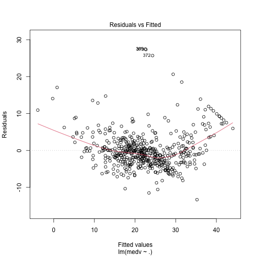

There is an obvious curvature in the above plot which explains that it is deviating from Mean 0 assumption. 

Plotting the residuals plots to check where the non linearity is coming from:

```r
residualPlots(model)
```

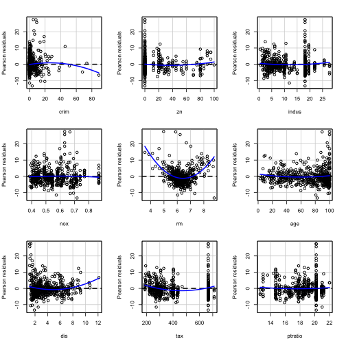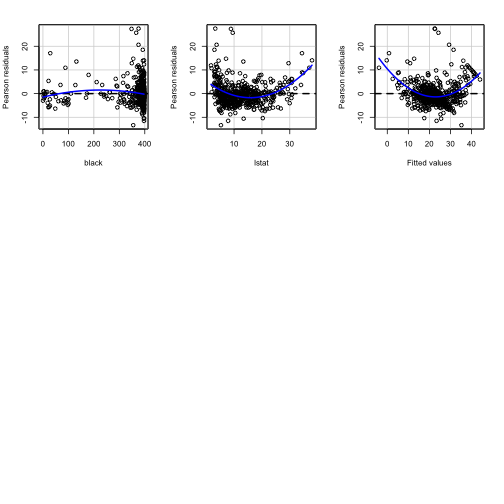

```
##            Test stat Pr(>|Test stat|)    
## crim         -2.4854          0.01327 *  
## zn            1.4242          0.15503    
## indus         1.2836          0.19989    
## nox          -1.0419          0.29799    
## rm           12.6039        < 2.2e-16 ***
## age           1.7050          0.08883 .  
## dis           4.3938        1.365e-05 ***
## tax           4.0370        6.275e-05 ***
## ptratio       0.9109          0.36282    
## black        -2.1834          0.02948 *  
## lstat        10.5122        < 2.2e-16 ***
## Tukey test   14.0829        < 2.2e-16 ***
## ---
## Signif. codes:  0 '***' 0.001 '**' 0.01 '*' 0.05 '.' 0.1 ' ' 1
```

We can observe that rm and lstat are clearly non linear.

## Homoscedasticity

```r
plot(model, which=1)
```


Observe that the variance is not equal, it is not complying with the homoscedasticity assumption

## Normality

```r
qqPlot(model$residuals)
```

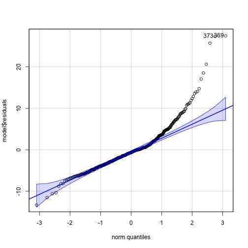

```
## [1] 369 373
```

Normality assumption is being violated as the points are clearly deviated from the diagonal line in the QQ Plot.

## Outliers in predictor via hatvalues

```r
# h is the threshold for suspects
plot(hatvalues(model), type='h', col="blue", ylab="Hat Values", main="Hat values")
n = dim(data)[1]
p = dim(data)[2]-1
abline(h = 2 * (p + 1) / n, lty = 2,col = 'darkred')
```

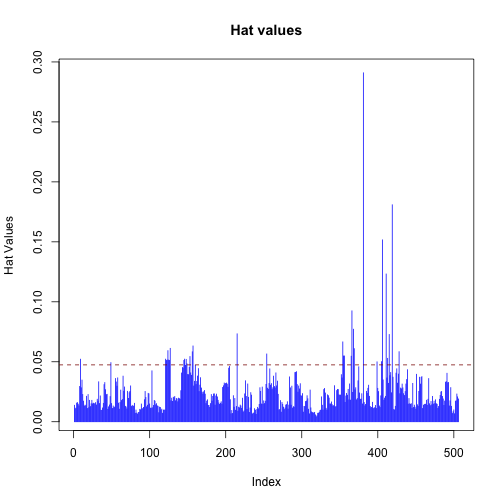

The points above the threshold have more leverage and are the suspected outliers in predictor.

## Outliers in response via externally studentized residuals


```r
# h is the threshold for suspects
plot(abs(rstudent(model)), type='h', col="blue",
     ylab="Externally Studentized Residuals (in absolute value)",
     main="Externally Studentized Residuals (in absolute value)")
abline(h = qt(.95, n-p-2), lty=2) # threshold for suspects
```

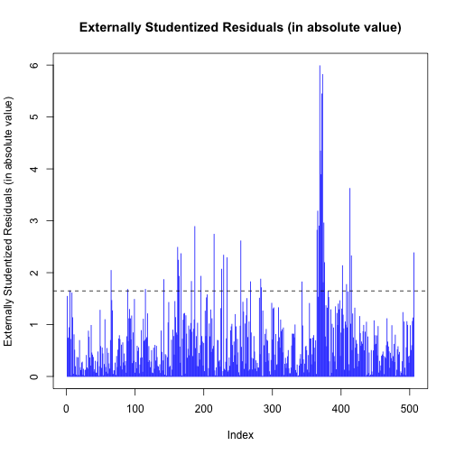

The points above the threshold have more leverage and are the suspected outliers in response.

## Influential observations via Cook’s distance


```r
#suspects are highlighted on the graph
par(mfrow=c(1,1))
plot(model, which=4, col="blue", lwd=2) 
abline(h = 4/n, lty=2) #threshold for suspects
```

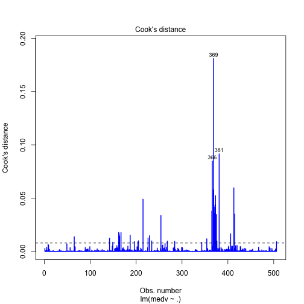


## Influential observations via DFBETAS

```r
par(mfrow=c(3,4)) 
for (j in 1:12) {
  plot(abs(dfbetas(model)[,j]), col=4, type='h', ylab='DFBETAS', xlab = names(data)[j])
    abline(h = 2/sqrt(n), lty=2) # threshold for suspects 
}
```

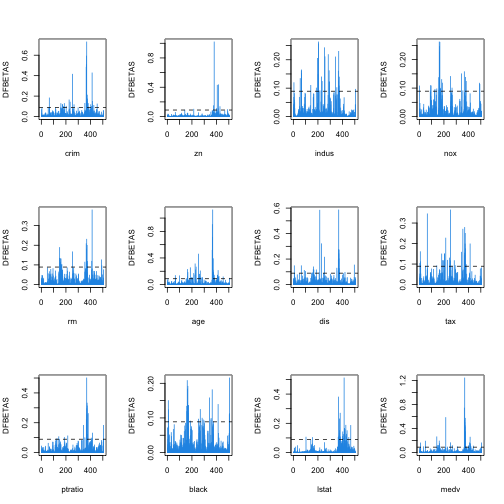

An observation can be considered to be influential in estimating a given parameter if it has a DBETAS value greater than a threshold value. Thus, the points that lie above the threshold in the plots are influential.

## Influential observations via DFFITS


```r
par(mfrow=c(1,1))
plot(abs(dffits(model)), typ='h', col=4, ylab='DFFITS') 
abline(h = 2*sqrt(p/n), lty=2) # threshold for suspects
```

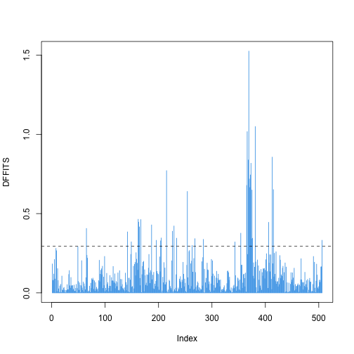

DFFITS - difference in fits, it quantifies the number of standard deviations that the fitted value changes when the nth point in the data is left out. Observations that have DFFITS values greater than a threshold in the plot are influential.

## Multicolinearity


```r
#correlation between all predictors
df_cor = round( cor(data) , 2)
df_cor
```

```
##          crim    zn indus   nox    rm   age   dis   tax ptratio black lstat
## crim     1.00 -0.20  0.41  0.42 -0.22  0.35 -0.38  0.58    0.29 -0.39  0.46
## zn      -0.20  1.00 -0.53 -0.52  0.31 -0.57  0.66 -0.31   -0.39  0.18 -0.41
## indus    0.41 -0.53  1.00  0.76 -0.39  0.64 -0.71  0.72    0.38 -0.36  0.60
## nox      0.42 -0.52  0.76  1.00 -0.30  0.73 -0.77  0.67    0.19 -0.38  0.59
## rm      -0.22  0.31 -0.39 -0.30  1.00 -0.24  0.21 -0.29   -0.36  0.13 -0.61
## age      0.35 -0.57  0.64  0.73 -0.24  1.00 -0.75  0.51    0.26 -0.27  0.60
## dis     -0.38  0.66 -0.71 -0.77  0.21 -0.75  1.00 -0.53   -0.23  0.29 -0.50
## tax      0.58 -0.31  0.72  0.67 -0.29  0.51 -0.53  1.00    0.46 -0.44  0.54
## ptratio  0.29 -0.39  0.38  0.19 -0.36  0.26 -0.23  0.46    1.00 -0.18  0.37
## black   -0.39  0.18 -0.36 -0.38  0.13 -0.27  0.29 -0.44   -0.18  1.00 -0.37
## lstat    0.46 -0.41  0.60  0.59 -0.61  0.60 -0.50  0.54    0.37 -0.37  1.00
## medv    -0.39  0.36 -0.48 -0.43  0.70 -0.38  0.25 -0.47   -0.51  0.33 -0.74
##          medv
## crim    -0.39
## zn       0.36
## indus   -0.48
## nox     -0.43
## rm       0.70
## age     -0.38
## dis      0.25
## tax     -0.47
## ptratio -0.51
## black    0.33
## lstat   -0.74
## medv     1.00
```

Correlation heatmap


```r
#the higher the absolute value, higher the correlation.
#the -/+ sign tells us if they are negatively or positively correlated.
#if two predictors are correlated, they increase the overall variance in the model.
corrplot.mixed(df_cor)
```

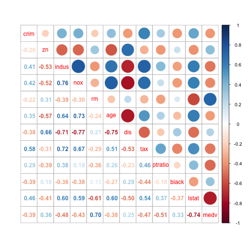

Here nox and indus have the most correlation.

## Checking for multicolinearity via variance inflation factors (VIF)


```r
# VIF tells us what fraction of the variance of one predictor can be explained
# by the other predictors.
# High vif tells us that the predictor can be correlated to one or more predictors
# in the model.
vif(model)
```

```
##     crim       zn    indus      nox       rm      age      dis      tax 
## 1.663648 2.272992 3.660714 4.294324 1.880883 3.077311 3.953729 3.403205 
##  ptratio    black    lstat 
## 1.725085 1.338875 2.928554
```

```r
plot(vif(model), type='h', col=4, lwd=3)
abline(h = 5, lty=2)
```

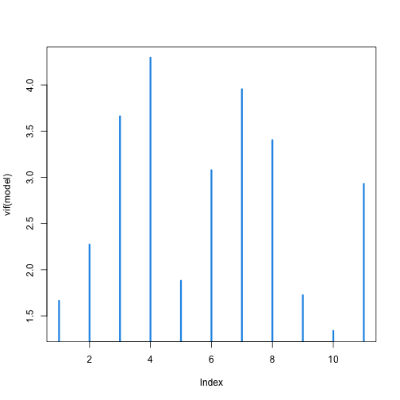

Here nox, dis, indus, tax could be the suspected predictors based on their high vif values.
