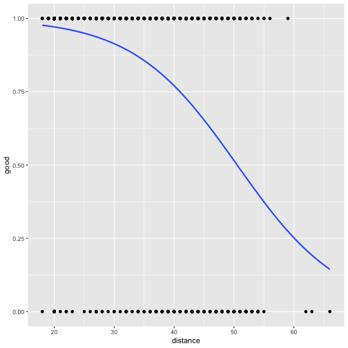

# Logistic Regression, Forward Selection, and Bootstrapping


Reading the dataset

```r
placekick <- read.csv("data/Placekick.csv", header=TRUE, stringsAsFactors=FALSE)
```

Fitting the logistic regression model with "good" as response and "distance" as preditor

```r
fit=glm(good~distance,family = binomial(link = logit),data=placekick)
summary(fit)
```

```
## 
## Call:
## glm(formula = good ~ distance, family = binomial(link = logit), 
##     data = placekick)
## 
## Deviance Residuals: 
##     Min       1Q   Median       3Q      Max  
## -2.7441   0.2425   0.2425   0.3801   1.6092  
## 
## Coefficients:
##              Estimate Std. Error z value Pr(>|z|)    
## (Intercept)  5.812080   0.326277   17.81   <2e-16 ***
## distance    -0.115027   0.008339  -13.79   <2e-16 ***
## ---
## Signif. codes:  0 '***' 0.001 '**' 0.01 '*' 0.05 '.' 0.1 ' ' 1
## 
## (Dispersion parameter for binomial family taken to be 1)
## 
##     Null deviance: 1013.43  on 1424  degrees of freedom
## Residual deviance:  775.75  on 1423  degrees of freedom
## AIC: 779.75
## 
## Number of Fisher Scoring iterations: 6
```
Here the coefficient of distance is negative, meaning that as the distance increases the probability of success decreases. Here the p-value of distance is also significantly lower which shows that the predictor is significant.

In logistic regression, the coefficients represent the change in the log odds of the response variable for a one-unit increase in the corresponding predictor variable, holding all other predictor variables constant.

In this case, for one unit increase in "distance", the odds increases by a factor of exp(-0.115027) = 0.891. This is about 10% decrease in odds of "good"(success)


```r
library(ggplot2)
ggplot(data=placekick, aes(x = distance, y = good)) +
  geom_point() +
  stat_smooth(method = "glm", method.args = list(family = "binomial"), se = FALSE)
```

```
## `geom_smooth()` using formula = 'y ~ x'
```


The plot shows that the probability of success decreases as the distance of the placekick increases.

Now considering all the predictors and applying Forward Selection Algorithm to choose the best model. Fitting from null model to full model

```r
null_model=glm(good~1,family = binomial(link = logit),data=placekick)
full_model=glm(good~.,family = binomial(link = logit),data=placekick)

forward_aic = step(null_model,scope = formula(full_model), direction="forward")
```

```
## Start:  AIC=1015.43
## good ~ 1
## 
##            Df Deviance     AIC
## + distance  1   775.75  779.75
## + PAT       1   834.41  838.41
## + change    1   989.15  993.15
## + elap30    1  1007.71 1011.71
## + wind      1  1010.59 1014.59
## + week      1  1011.24 1015.24
## + type      1  1011.39 1015.39
## <none>         1013.43 1015.43
## + field     1  1012.98 1016.98
## 
## Step:  AIC=779.75
## good ~ distance
## 
##          Df Deviance    AIC
## + PAT     1   762.41 768.41
## + change  1   770.50 776.50
## + wind    1   772.53 778.53
## <none>        775.75 779.75
## + week    1   773.86 779.86
## + type    1   775.67 781.67
## + elap30  1   775.68 781.68
## + field   1   775.74 781.74
## 
## Step:  AIC=768.41
## good ~ distance + PAT
## 
##          Df Deviance    AIC
## + change  1   759.33 767.33
## + wind    1   759.66 767.66
## <none>        762.41 768.41
## + week    1   760.57 768.57
## + type    1   762.25 770.25
## + elap30  1   762.31 770.31
## + field   1   762.41 770.41
## 
## Step:  AIC=767.33
## good ~ distance + PAT + change
## 
##          Df Deviance    AIC
## + wind    1   756.69 766.69
## + week    1   757.26 767.26
## <none>        759.33 767.33
## + elap30  1   759.11 769.11
## + type    1   759.13 769.13
## + field   1   759.33 769.33
## 
## Step:  AIC=766.69
## good ~ distance + PAT + change + wind
## 
##          Df Deviance    AIC
## <none>        756.69 766.69
## + week    1   755.07 767.07
## + type    1   756.06 768.06
## + elap30  1   756.43 768.43
## + field   1   756.66 768.66
```

Now fitting the best fit model suggested by the step function.

```r
best_fit = glm(formula = formula(forward_aic), family = binomial(link = logit), data = placekick)
beta = summary(best_fit)$coefficients[,1]
beta
```

```
## (Intercept)    distance         PAT      change        wind 
##  4.75156983 -0.08723696  1.22991739 -0.33505071 -0.52343574
```
This model tells us that probability of success is negatively affceted by distance, change and wind but positively affected by PAT.

Getting predictor names suggested by the Forward Selection Algorithm

```r
best_fit_pred <- all.vars(formula(forward_aic))[-1]
best_fit_res <- all.vars(formula(forward_aic))[1]
```

Now computing the decision boundary

```r
B = as.matrix(beta)
X = as.matrix(cbind(1,placekick[,best_fit_pred]))
prob <- exp(X%*%B)/(1+exp(X%*%B))
decision <- ifelse(prob >= 0.5, 1, 0)
table(decision,placekick$good)
```

```
##         
## decision    0    1
##        0   18   13
##        1  145 1249
```
Creating BootGLM Function which takes x,y and B as input and returns the Standard Error for each of the Predictor Variables

```r
bootGLM <- function(x, y, B=1000) {
  set.seed(1)
  y = data.frame(y)
  x = data.frame(x)
  n = nrow(x)
  m = ncol(x)

  coef <- c()
  for (i in 1:B){
    indices = sample(1:n,n,replace=TRUE)
    x_boot = x[indices,]
    y_boot = y[indices,]
    fit_boot=glm(formula = y_boot ~ ., family = binomial(link = logit), data = x_boot)
    coef <- rbind(coef,fit_boot$coefficients)
  }
  
  return(apply(coef, 2, sd))
}
```

Fitting the predictors suggested by Forward Selection Algorithm with our bootGLM Function

```r
x = placekick[,best_fit_pred]
y = placekick[best_fit_res]
boot_se = bootGLM(x,y)
```

Comparing the Standard Error returned from the bootGLM function with the Summary function

```r
best_fit_se <-summary(best_fit)$coefficients[,2]
print(best_fit_se)
```

```
## (Intercept)    distance         PAT      change        wind 
##  0.47199923  0.01111711  0.38474229  0.19334821  0.31315327
```

```r
print(boot_se)
```

```
## (Intercept)    distance         PAT      change        wind 
##  0.47085490  0.01105268  0.40818792  0.19512736  0.29637236
```
Looking at the percentage difference in Standard Errors between the 2 models

```r
(boot_se - best_fit_se)*100/best_fit_se
```

```
## (Intercept)    distance         PAT      change        wind 
##  -0.2424444  -0.5796095   6.0938515   0.9201844  -5.3586883
```
Here, the standard errors for Intercept, distance, change are not so different in the 2 models but Bootstrap suggests that the standard error for PAT should be 6.09% higher and standard error for Wind should be 5.35% lower. 
