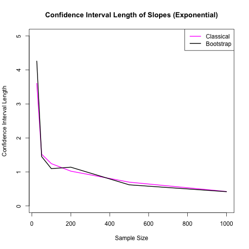

# Studentized Bootstrap and Student Confidence Intervals


This function takes 4 parameters:
 x: explanatory variable
 y: response variable
 conf: the confidence interval
 B: number of bootstrap iterations
 
Firstly it fits and summarizes a linear model on actual sample of x and y.
Then it runs bootstrap B times, takes random samples of size N from the samples with replacement and then fits the linear model on the generated random samples.
Then it calculates the Studentized Confidence Interval for both the coefficients using the T-values calculated using coefficients and standard errors. 

The function returns the student confidence interval width and studentized bootstrap confidence interval width for both the coefficients.


```r
set.seed(42)
bootLS <- function(x,y,conf=0.95,B=1000) {
  
  N = length(x)
  
  # fit the linear model
  fit = lm(y~x)
  beta0 = fit$coefficients[1]
  beta1 = fit$coefficients[2]
  sebeta0=summary(fit)$coefficients[,2][1]
  sebeta1=summary(fit)$coefficients[,2][2]
  
  beta0_boot = rep(NA,B)
  beta1_boot = rep(NA,B)
  t0_boot = rep(NA,B)
  t1_boot = rep(NA,B)
  

  for (i in 1:B){
    indices = sample(1:N,N,replace=TRUE)
    x_boot = x[indices]
    y_boot = y[indices]
    fit_boot=lm(y_boot~x_boot)
    beta0_boot[i] = fit_boot$coefficients[1]
    beta1_boot[i] = fit_boot$coefficients[2]
    sebeta0_boot = summary(fit_boot)$coefficients[,2][1]
    sebeta1_boot = summary(fit_boot)$coefficients[,2][2]
    t0_boot[i]=(beta0_boot[i]-beta0)/(sebeta0_boot)
    t1_boot[i]=(beta1_boot[i]-beta1)/(sebeta1_boot)
  }
  
  boot_int = matrix(c(beta0 + quantile(t0_boot,c((1-conf)/2,(1+conf)/2))*sebeta0),ncol = 2)
  colnames(boot_int) = c(paste(toString((1-conf)*100/2),"%"),paste(toString((1+conf)*100/2),"%"))
  
  boot_slp = matrix(c(beta1 + quantile(t1_boot,c((1-conf)/2,(1+conf)/2))*sebeta1),ncol = 2)
  colnames(boot_slp) = c(paste(toString((1-conf)*100/2),"%"),paste(toString((1+conf)*100/2),"%"))
  
  return(c(confint(fit)[1,2]-confint(fit)[1,1],
           confint(fit)[2,2]-confint(fit)[2,1],
           boot_int[2]-boot_int[1],
           boot_slp[2]-boot_slp[1]))
  
}
```

Here we intend to compare the length and confidence level of studentized bootstrap confidence interval and the classical student confidence interval. We are going to run for 6 difference sample sizes n.

Firstly, we check the simulation when the error is normally distributed and secondly we will see the simulation when the error is exponentially distributed.

We run the bootstrap for 1000 iterations and confidence interval 95%

We expect to see that the length of the confidence interval decreases as the sample size increases.


```r
set.seed(42)
n= c(25,50,100,200,500,1000)
res = c()
for (i in n){
  x <- runif(i, -1, 1)
  y <- 1 + 2*x + rnorm(i,mean=0,sd=0.5)
  res = rbind(res,bootLS(x,y))

}

res <- cbind(n,res)
res_norm <- as.data.frame(res)
names(res_norm) <- c('n','ClassicalIntDiff','ClassicalSlpDiff','BootstrapIntDiff','BootstrapSlpDiff')
res_norm
```

```
##      n ClassicalIntDiff ClassicalSlpDiff BootstrapIntDiff BootstrapSlpDiff
## 1   25       0.38914332        0.6063626       0.35451657        0.5154250
## 2   50       0.28005617        0.4743600       0.28237493        0.4559870
## 3  100       0.22064064        0.3832864       0.22766411        0.3874367
## 4  200       0.12933044        0.2200260       0.12396871        0.2061352
## 5  500       0.08865944        0.1571786       0.09360471        0.1558189
## 6 1000       0.06139652        0.1062528       0.06288176        0.1025256
```


```r
plot(res_norm$n,res_norm$ClassicalIntDiff,type='l',col='magenta',main="Confidence Interval Length of Intercepts (Normal)",xlab="Sample Size",ylab="Confidence Interval Length",lwd=2)
lines(res_norm$n,res_norm$BootstrapIntDiff,type='l',col='black',lwd=2)
legend('topright', c('Classical','Bootstrap'), col=c('magenta','black'), lwd=2)
```


```r
plot(res_norm$n,res_norm$ClassicalSlpDiff,type='l',col='magenta',main="Confidence Interval Length of Slopes (Normal)",xlab="Sample Size",ylab="Confidence Interval Length",lwd=2)
lines(res_norm$n,res_norm$BootstrapSlpDiff,type='l',col='black',lwd=2)
legend('topright', c('Classical','Bootstrap'), col=c('magenta','black'), lwd=2)
```


The classical student confidence interval assumes that the data is normally distributed.
In this case the introduced error is indeed normally distributed, therefore we can see that the studentized bootstrap confidence interval is mostly similar to the classical studnet confidence interval.
It gets closer to the classical student confidence interval as the sample size increases.


```r
set.seed(42)
n= c(25,50,100,200,500,1000)
res = c()
lambda = 0.5
for (i in n){
  x <- runif(i, -1, 1)
  y <- 1 + 2*x + (rexp(i, rate=lambda) - 1/lambda) 
  res = rbind(res,bootLS(x,y))
}
res <- cbind(n,res)
res_exp <- as.data.frame(res)
names(res_exp) <- c('n','ClassicalIntDiff','ClassicalSlpDiff','BootstrapIntDiff','BootstrapSlpDiff')
res_exp
```

```
##      n ClassicalIntDiff ClassicalSlpDiff BootstrapIntDiff BootstrapSlpDiff
## 1   25        2.3135965        3.6050430        4.1545965        4.2605160
## 2   50        0.9394795        1.5208497        0.9933110        1.4530487
## 3  100        0.7530122        1.2439921        0.7330827        1.0959351
## 4  200        0.5835517        1.0230736        0.6146998        1.1395839
## 5  500        0.3927941        0.6995075        0.4028060        0.6210938
## 6 1000        0.2456272        0.4236093        0.2402080        0.4195038
```


```r
plot(res_exp$n,res_exp$ClassicalIntDiff,type='l',col='magenta',main="Confidence Interval Length of Intercepts (Exponential)",xlab="Sample Size",ylab="Confidence Interval Length",lwd=2,ylim=c(0,5))
lines(res_exp$n,res_exp$BootstrapIntDiff,type='l',col='black',lwd=2)
legend('topright', c('Classical','Bootstrap'), col=c('magenta','black'), lwd=2)
```


```r
plot(res_exp$n,res_exp$ClassicalSlpDiff,type='l',col='magenta',main="Confidence Interval Length of Slopes (Exponential)",xlab="Sample Size",ylab="Confidence Interval Length",lwd=2,ylim=c(0,5))
lines(res_exp$n,res_exp$BootstrapSlpDiff,type='l',col='black',lwd=2)
legend('topright', c('Classical','Bootstrap'), col=c('magenta','black'), lwd=2)
```



The exponential distribution is skewed compared to the normal distribution, therefore it has a higher probability of extreme values. The bootstrap method does not hold any assumptions regarding the underlying distribution so it is better suited for this type of error than the classic one. Although, as the sample size increases both get more and more accurate.

Overall, the accuracy of the bootstrap estimates for both distributions improves as the sample size increases. However, the accuracy of the bootstrap estimates for the exponential distribution may be more affected by extreme values than the normal distribution.
